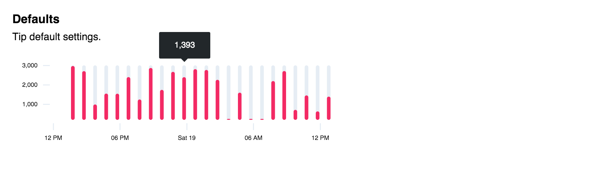

# d3-tipy

 D3 tooltip. See source for examples and documentation.



## Installation

```
$ npm install d3-tipy
```

## Developing

Build:

```
$ make build
```

Start dev server:

```
$ make start
```

## Badges


---

> [tjholowaychuk.com](http://tjholowaychuk.com) &nbsp;&middot;&nbsp;
> GitHub [@tj](https://github.com/tj) &nbsp;&middot;&nbsp;
> Twitter [@tjholowaychuk](https://twitter.com/tjholowaychuk)
